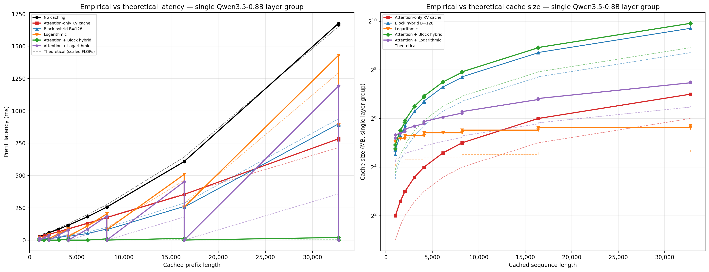
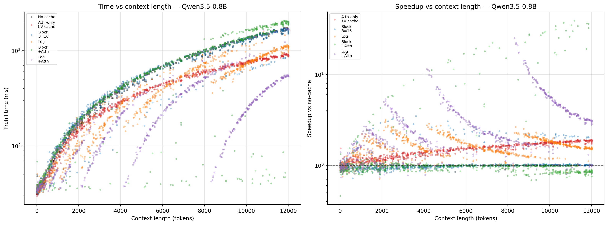

# Recurrent State Prefix Caching

**TL;DR:** For LLMs with linear attention (e.g. Mamba2, Qwen3.5), full per-token prefix caching is inefficient: GDN recurrent state is $d_\text{head}^2$ per head vs $d_\text{head}$ for classical GQA KV. One solution is [per-block caching](https://github.com/vllm-project/vllm/pull/26807), which stores GDN states at every cache block boundary (e.g. every 16 tokens), and fully avoid recomputation in case of cache hit. 

This work proposes intermediate solution - it exchanges _some_ recomputaion as a price for sublinear (in length of cached sequence) size.

## Background: prefix caching today

Prefix caching avoids redundant computation when several requests share the same prompt prefix. When a new request matches a cached prefix, the corresponding KV blocks are reused, skipping recomputation. For standard transformers this works well: if 900 out of 1000 prefix tokens are cached, you reuse 900 and recompute only 100.

### The hybrid model challenge

While what follows applies to **any state-space or hybrid model**, I illustrate with the [Qwen3.5](https://qwen.ai/blog?id=qwen3.5) model family.

In Qwen3.5, consecutive layers are grouped by 4: 3 **Gated DeltaNet** (GDN) layers followed by 1 full attention layer. For GDN layers, the recurrent state is the result of sequential in-place updates — the state at position $t$ is independent of states at $s<t-1$ given state at time $t-1$. **Caching state for every token** is prohibitive: GDN state is $d_\text{head}^2$ per head per token vs $d_\text{head}$ for attention KV.

However, GDN only needs the state at position $t-1$ to produce position $t$ (unlike full attention, which needs the entire KV history). So if we store **some** states, we can always resume from the closest previous cached checkpoint.

**Current vLLM status** ([tracking issue](https://github.com/vllm-project/vllm/issues/26201), Mar 2026): Mamba1 prefix full caching merged. [GatedDeltaNet support](https://github.com/vllm-project/vllm/pull/26807) is pending review with per-block-boundary caching. Other linear attention models not yet supported.

## Proposal

Balance caching and recomputation by storing states at selected positions:

* **Logarithmic ($2^i$) caching:** Store states at positions $1, 2, 4, 8, \ldots, 2^{\lfloor\log_2 N\rfloor}$. Guarantees reusing $\geq N/2$ tokens of a length-$N$ common prefix (worst case 50%, average ~69%). Cache size: $O(\log L)$ per sequence.

> **TODO:** **$\sqrt{N}$ caching:** Store states at $\sqrt{L}$-spaced boundaries. Reduces GDN recomputation from $O(N)$ to $O(\sqrt{N})$ in $O(\sqrt{L})$ memory.

> There seem to be a research gap for principled mass-serving theory to optimally balance checkpoint placement, memory budget, and expected prefix distributions.

Currently vLLM uses $O(L/B)$ checkpoints (linear in sequence length) to eliminate all GDN recomputation. Proposed methods trade some recomputation for asymptotically less memory, leading to higher cache hit rates under fixed memory budgets.

# Case study: Qwen3.5

> Qwen3.5 architecture image from [CalvinXKY/InfraTech](https://github.com/CalvinXKY/InfraTech/tree/main/models/qwen3_5)

#### Baseline FLOPs

Since prefill is compute-bound, FLOP is a good proxy for latency. **Per token per layer group:**

| Module | Formula | 27B | 0.8B | Comment |
| --- | --- | --- | --- | --- |
| FFN (×4) | $4 \times 3 \times d \times d_\text{ff}$ | 1.07e9 | 4.40e7 | 3 projections per FFN, 4 FFN per group |
| GA Q,O,Gate proj | $3 \times d \times n_q \times d_a$ | 9.44e7 | 6.29e6 | 27B: $n_q=24$, 0.8B: $n_q=8$; $d_a=256$ |
| GA KV proj | $2 \times d \times n_\text{kv} \times d_a$ | 1.05e7 | 1.05e6 | 27B: $n_\text{kv}=4$, 0.8B: $n_\text{kv}=2$ |
| GA quadratic | $n_q \times d_a \times N$ | 6.1e3$N$ | 2.05e3$N$ | Attention cost |
| GDN V,Gate,O proj (×3) | $3 \times 3 \times d \times n_v \times d_h$ | 2.83e8 | 1.89e7 | 27B: $n_v=48$, 0.8B: $n_v=16$; $d_h=128$ |
| GDN Q,K proj (×3) | $3 \times 2 \times d \times n_{qk} \times d_h$ | 6.29e7 | 1.26e7 | $n_{qk}=16$ |
| GDN $\alpha, \beta$ proj (×3) | $3 \times 2 \times d \times n_v$ | 1.47e6 | 9.83e4 | |
| GDN recurrence (×3) | $3 \times n_v \times d_h^2$ | 2.36e6 | 7.86e5 | State shape $d_h \times d_h$ |
| **Total** | | **1.52e9 + 6.1e3$N$** | **8.37e7 + 2.05e3$N$** | |

#### Saved Flop Estimation

| method | compute saved | cache size per layer group per sequence |
| --- | --- | --- |
| Only full attention | 1/4 FFN + all GA  | $L \times n_{kv} \times d_a \times 2 $ |
| Block hybrid cache | ~3/4 FFN + all GDN | $3L \times n_v \times d_h^2 / B$
| Logarithmic | **worst case** 3/8 FFN + 1/2 GDN   **average** 9/16 FFN + 3/4 GDN | $3\log(L) \times n_v \times d_h^2$

## Huggingface Transformers prototype

> TODO: swipe block size

The code can be found in `benchmark_baselines.py`. Theoretical (dashed) lines correspond to number of floating-point operations according to the table above.

### E2E benchmark on ShareGPT traces

To evaluate caching strategies under realistic workloads, `benchmark_e2e.py` replays multi-turn conversations from the [tucnguyen/ShareGPT](https://huggingface.co/datasets/tucnguyen/ShareChat) dataset through a single Qwen3.5-0.8B layer group with random weights.

> **IMPORTANT:** a number of simplifications is applied in this tests. See `benchmark_e2e.py` for detailed discussion and real-world applicability of these numbers.

> Left panel — Prefill time vs context length. Here i have 40 dialog histories and send them in random order preserving in-conversation order. I measure prefill wall time, cache is stored at CPU. In total, there are 852 requests and 3 GB prefix cache budget (5M tokens overall). Right panel — per-request relative speedup.

Speedup is possible because logarithmic checkpoints use $\sim O(\log L)$ memory per entry (vs $O(L/B)$ for block), so more conversations fit in the 3 GB budget simultaneously, yielding higher hit rates (80% cache hits vs 10% for block-boundary).

> **TODO:** add relative speedup boxplot
> **TODO:** there seem to be some memory overhead in transformers -- OOM happen much earlier that expected. Study this

